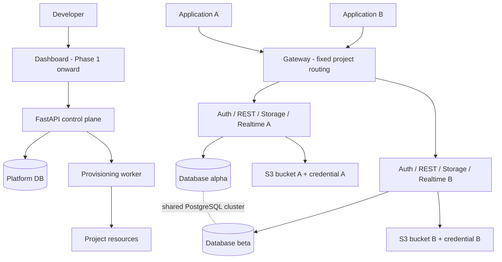

# SiBase — Architecture / Phase 0

เอกสารนี้บันทึก topology และข้อจำกัดของ Phase 0 ซึ่งยังเก็บไว้ทดสอบซ้ำ Phase 1 เพิ่ม Dashboard/Control API แบบอ่านอย่างเดียว, platform PostgreSQL แยก instance, monitor roles และ passwords แยกต่อ role ตาม [ADR 0004](decisions/0004-phase1-foundation.md) และ [migration boundaries](../migrations/README.md); ยังไม่มี provisioning worker หรือบัญชีแพลตฟอร์ม

## การแยกความรับผิดชอบ

Control plane จะใช้ FastAPI จัดการ workspace, membership, project registry และ provisioning jobs โดยมี platform database แยกต่างหาก ส่วน data plane ของแต่ละโปรเจกต์ประกอบด้วย PostgreSQL database, Auth, PostgREST, Storage และ Realtime; Dashboard ใช้ React/TypeScript

Phase 0 ทดสอบเฉพาะ data plane และเส้นทาง SDK ด้วย bootstrap CLI แทน control plane ผลทดสอบและข้อจำกัดต้องอ่านประกอบใน [รายงาน Phase 0](phase0-report.md)

## PoC topology และ endpoints

Compose project ชื่อ `sibase-phase0` มี PostgreSQL cluster หนึ่งชุด, database `alpha`/`beta`, บริการ Auth/REST/Storage/Realtime อย่างละสอง instance, S3-compatible SeaweedFS หนึ่งชุด และ Nginx gateway

| ขอบเขต | Endpoint | ผู้เข้าถึง |
| --- | --- | --- |
| Alpha | `http://127.0.0.1:58101` | Local host ผ่าน project key |
| Beta | `http://127.0.0.1:58102` | Local host ผ่าน project key |
| Auth | `/auth/v1/` | SDK/HTTP client |
| REST | `/rest/v1/` | SDK/HTTP client |
| Storage | `/storage/v1/` | SDK/HTTP client |
| Realtime | `/realtime/v1/` | SDK/WebSocket client |
| DB/S3/Realtime management | Docker network ภายใน | Service/test runner เท่านั้น |

Database และ S3 ไม่มี host port; gateway bind เฉพาะ loopback PoC ใช้ HTTP เพื่อทดสอบ local; staging ต้องใช้ TLS

## Project identity และ database roles

โปรเจกต์ถูกกำหนดจาก listener/routing ของ gateway ร่วมกับ API key และ signing secret แยกกัน ไม่ใช้ `project_id` ที่ client ส่งมาเพื่อตัดสินสิทธิ์

PostgreSQL roles มีขอบเขตทั้ง cluster จึงแยก LOGIN roles เป็น `<project>_auth`, `_rest`, `_storage`, `_realtime`, `_owner`; shared roles `anon`, `authenticated`, `service_role` และ `supabase_realtime_admin` เป็น NOLOGIN และไม่ได้รับ CONNECT ไปยังฐานข้อมูลใดโดยตรง Revoke database privileges ของ PUBLIC ก่อนให้ CONNECT เฉพาะ LOGIN roles ที่เกี่ยวข้อง

| Role | ขอบเขตและเหตุผล |
| --- | --- |
| `<project>_auth` | เป็นเจ้าของ `auth` schema และ migrations ของ Auth |
| `<project>_rest` | NOINHERIT; สลับเป็น request role ตาม JWT; ไม่เป็น table owner |
| `<project>_storage` | เป็นเจ้าของ storage metadata และทำงานภายในบริการ; สลับเป็น user role สำหรับ RLS |
| `<project>_realtime` | Replication และ tenant migrations ภายใน database ตนเอง; privileged service credential |
| `<project>_owner` | สร้าง/จัดการ application tables; ไม่เป็น superuser และสร้าง cluster roles ไม่ได้ |
| `postgres` | Local bootstrap/test administrator เท่านั้น; ไม่ส่งให้ end-user SDK |

NOLOGIN ไม่ได้แปลว่าไม่มีสิทธิ์: service credentials ที่สามารถ `SET ROLE service_role` ย่อมข้าม RLS ได้ จึงต้องอยู่ฝั่งบริการเท่านั้น การแยก database ช่วยแยกข้อมูลตามกรณีที่ทดสอบ แต่ไม่แยก CPU/memory/disk, ไม่ซ่อน cluster catalogs และไม่รับประกันว่า privileged service compromise จะถูกจำกัดทุกช่องทาง

PoC ใช้รหัสผ่าน DB หนึ่งค่าต่อโปรเจกต์ร่วมกันในห้า LOGIN roles การทดสอบห้าม `SET ROLE` จึงไม่ใช่หลักฐานว่าผู้ถือรหัสผ่านนั้นสวม identity อื่นในโปรเจกต์เดียวกันไม่ได้ ห้ามแจก credentials เหล่านี้; ต้องแยก secrets ต่อ role ใน runtime ที่จะเปิดใช้งานจริง

Auth ใช้ HS256 key แยกโปรเจกต์สำหรับ PoC และ access token อายุ 15 นาที เพื่อพิสูจน์ integration ของชุดนี้ Phase 3 ต้องกำหนด key rotation/issuer validation ให้ครบทุกบริการและประเมิน asymmetric signing/JWKS การ logout ไม่ได้ทำให้ JWT ที่ยังไม่หมดอายุถูกเพิกถอนทันทีทุกบริการโดยอัตโนมัติ

## Schema ownership และ migrations

Bootstrap สร้าง databases, roles, schemas, extensions และ publication จาก source ของ SiBase ส่วน Auth/Storage/Realtime รัน migrations ของ upstream ที่ pin version แต่ละบริการมี schema ของตนเอง: `auth`, `storage`, `_realtime`, `realtime`

สำหรับ Realtime รุ่นที่ทดสอบ bootstrap ต้องสร้าง placeholder `dashboard_user` แบบ NOLOGIN, ให้ realtime login สืบทอด `supabase_realtime_admin` สำหรับ migrations ที่โอน ownership และให้ `SET log_min_messages` สำหรับ replication function รายละเอียดสิทธิ์อยู่ใน [project.sql](../poc/phase0/project.sql) ต้องทบทวน grants เหล่านี้เมื่อเปลี่ยน upstream version ไม่แทนที่ด้วย SUPERUSER

ตารางแอปอยู่ `public` และ PostgREST เปิดเฉพาะ schema นี้ ภายหลัง migrations ของ Auth จึงตั้ง `auth.uid()` ที่อ่านได้ทั้ง JWT claims รูปแบบ legacy และ JSON claims เพื่อใช้ policy เดียวกันข้ามบริการ ต้องนำ compatibility function นี้ไปอยู่ใน project-bootstrap migrations พร้อมทดสอบทุกครั้งที่ upgrade

PoC ใช้ `tasks.owner_id = auth.uid()` ทั้ง `USING` และ `WITH CHECK` และยืนยันว่าการเปลี่ยน owner ไปเป็นคนอื่นถูกปฏิเสธ เอกสารอ้างอิง: [PostgREST authentication](https://postgrest.org/en/stable/references/auth.html) และ [PostgreSQL RLS](https://www.postgresql.org/docs/current/ddl-rowsecurity.html)

## Storage และ Realtime

Storage API เก็บ metadata ใน project database; SeaweedFS เก็บไฟล์ใน `sibase-alpha`/`sibase-beta` และมี S3 identity ที่จำกัด bucket ต่อโปรเจกต์ มี bootstrap identity สำหรับสร้าง buckets เฉพาะใน local test runner

Realtime ใช้ logical replication โดย PostgreSQL image เพิ่ม `wal2json` เลือก publication รายตาราง และ tenant reference ต่างกัน (`realtime-alpha`/`realtime-beta`) ตาม host ที่ gateway กำหนด ตั้ง `SLOT_NAME_SUFFIX=alpha/beta` เพื่อให้ชื่อ slots ไม่ชนกัน; ผลทดสอบพบสี่ slots active พร้อมกัน

PoC สร้างแถวตัวอย่างแล้วตรวจ Realtime `UPDATE` จาก REST และ SQL; การรับ event `INSERT`, raw `DELETE` และ reconnect replay ยังไม่ใช่ contract ที่พิสูจน์แล้ว MVP วางแผนใช้ soft delete และ client ต้อง refetch หลัง reconnect อ้างอิง [Realtime Postgres Changes](https://supabase.com/docs/guides/realtime/postgres-changes)

การทดสอบรอ database-subscription system message สถานะ `ok` ก่อนเขียนข้อมูล ไม่อาศัยเพียง WebSocket `SUBSCRIBED` ส่วน Nginx ใช้ Docker DNS แบบ resolve ซ้ำเพื่อรองรับ container ที่เปลี่ยน IP หลัง recreate

## Provisioning contract สำหรับ Phase 2

1. ตรวจ membership/quota แล้วบันทึก project และ durable job ใน platform database
2. Worker จองชื่อทรัพยากรและสร้าง credentials; เก็บ secret reference ไม่ใส่ใน logs
3. สร้าง database/roles และรัน bootstrap พร้อม upstream migrations
4. ตั้ง bucket identity, Auth issuer, REST configuration และ Realtime tenant
5. รัน health/isolation smoke checks แล้วเปิด gateway route เมื่อพร้อม
6. บันทึก `ready` หรือ `failed` พร้อมขั้นตอนล่าสุด; retry จาก checkpoint โดยไม่สร้างซ้ำ

Phase 0 CLI ยังไม่มี crash recovery ของ workflow นี้; เป็นงาน Phase 2 ไม่ควรนำ CLI ไปใช้ provisioning สำหรับลูกค้าภายนอกโดยตรง
