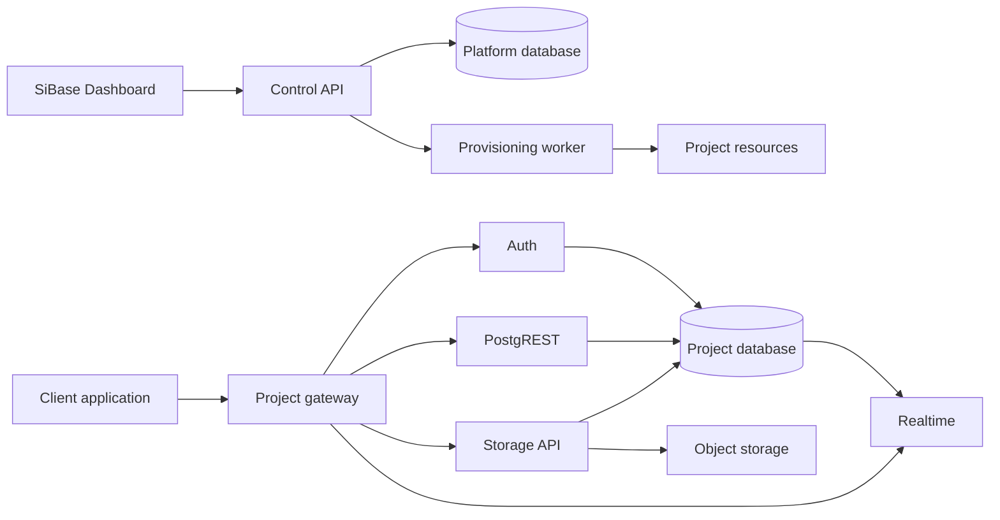

# SiBase — แผนพัฒนาแพลตฟอร์มแบบ Supabase

สถานะ: Phase 0–1 ผ่านแล้ว รวม GitHub CI จาก fresh checkout; Phase 2–9 ยังไม่เริ่ม · ปรับปรุง: 13 กันยายน 2026

## 1. เป้าหมายและขอบเขต

สร้าง Backend-as-a-Service ที่นักพัฒนาสามารถสร้างโปรเจกต์ ใช้ PostgreSQL จัดการผู้ใช้ เรียก REST API เก็บไฟล์ และติดตามการเปลี่ยนแปลงข้อมูลแบบ Realtime ผ่าน Dashboard เดียว

Repository มี local PoC และผล Phase 0 ผ่าน 17/17 กลุ่มตาม [รายงาน](phase0-report.md) Phase 1 เพิ่ม FastAPI แบบอ่านอย่างเดียว, Dashboard ที่แสดงสถานะจริง, platform database แยก และ workflow ทดสอบ โดย fresh-volume integration ผ่าน 19/19 กลุ่ม ดู [รายงาน Phase 1](phase1-report.md) งานสมาชิก/provisioning และ Phase 2–9 ยังเป็นแผน

### กลุ่มเป้าหมายและสมมติฐานสำหรับแผนนี้

- ผู้ใช้ยืนยันว่ารุ่นแรกใช้กับทีมภายในเพื่อสร้างแอปและระบบงาน; เริ่ม self-hosted บนเครื่องพัฒนาและวางแผน staging หนึ่ง region
- รองรับหลายโปรเจกต์ตั้งแต่ MVP โดยแยกฐานข้อมูลและ credentials ต่อโปรเจกต์บน PostgreSQL cluster ร่วมกัน; ยังไม่รับประกันการแยกทรัพยากรระดับเครื่อง
- ทีมประมาณ 2–3 นักพัฒนา พร้อมผู้ช่วยด้านออกแบบและระบบตามจำเป็น; ระยะเวลาเป็นประมาณการที่ต้องปรับหลัง Phase 0
- พัฒนา control plane และ Dashboard ของ SiBase พร้อมประกอบบริการ open source ที่เหมาะสม; ความเข้ากันได้กับ Supabase SDK ต้องผ่านการทดสอบก่อนประกาศรองรับ

### ขอบเขต MVP

| ความสามารถ | สิ่งที่ต้องใช้งานได้ |
| --- | --- |
| Projects | สร้าง workspace/โปรเจกต์ จัดการสมาชิก ดูสถานะและ endpoint |
| Database | สร้างตาราง คอลัมน์ primary/foreign key และ index; ดูและแก้ไขแถวข้อมูล |
| Authentication | Email/password, ยืนยันอีเมล, reset password, refresh session และ logout |
| APIs | REST CRUD, filtering, sorting, pagination และตัวอย่างเรียก API |
| Permissions | สิทธิ์สมาชิก workspace และ Row-Level Security (RLS) สำหรับข้อมูลแอป |
| Storage | Private/public buckets, upload/download/delete และ signed URLs |
| Realtime | Subscribe การเปลี่ยนแปลงตารางที่เปิดใช้ พร้อมตรวจสิทธิ์และ reconnect |
| Dashboard | หน้าจอใช้งานทุกบริการ แสดง loading/error/empty state และข้อมูลการเชื่อมต่อ |

GraphQL, OAuth หลาย provider, SSO, billing, Edge Functions, multi-region และบริการสาธารณะแบบสมัครได้เอง อยู่หลัง MVP

## 2. สถาปัตยกรรมที่เสนอ

แยก **control plane** สำหรับเจ้าของโปรเจกต์และงานจัดการระบบ ออกจาก **data plane** ที่แอปของลูกค้าเรียกใช้งาน แนวทางประกอบ PostgreSQL กับบริการเฉพาะด้านสอดคล้องกับ [สถาปัตยกรรม Supabase](https://supabase.com/docs/guides/getting-started/architecture); รายการด้านล่างเป็นข้อเสนอสำหรับ SiBase

| ส่วนประกอบ | เทคโนโลยีตั้งต้น | หน้าที่ |
| --- | --- | --- |
| Dashboard | React + TypeScript + Vite | Workspace, Table Editor, Users, Storage, API และ Realtime |
| Control API | FastAPI + SQLAlchemy + Alembic | สมาชิก โปรเจกต์ metadata สิทธิ์ และ lifecycle |
| Provisioning worker | Python worker + durable job table | สร้างทรัพยากรและ retry งานที่ค้าง |
| Database | PostgreSQL | ฐานข้อมูลจัดการระบบแยกจากฐานข้อมูลโปรเจกต์ |
| Data API | PostgREST | แปลง schema ที่อนุญาตให้เป็น REST API |
| Auth | Supabase Auth | จัดการ identity/session; แยกบัญชีแพลตฟอร์มกับบัญชีผู้ใช้แอป |
| Storage | Supabase Storage + S3-compatible backend | เก็บ metadata/สิทธิ์ในฐานข้อมูล และไฟล์ใน object storage |
| Realtime | Supabase Realtime | Database changes ผ่าน logical replication และ WebSocket |
| Gateway / Runtime | Reverse proxy + Docker Compose | Routing, TLS, rate limits และ local/staging deployment |
| Verification | pytest, Vitest, Playwright | ทดสอบ backend, frontend และ workflow ข้ามบริการ |

Phase 0 เลือก SeaweedFS เป็น S3-compatible backend ของ PoC และบันทึกชุดเวอร์ชัน/digests ที่ทดสอบร่วมกันแล้วใน [third-party inventory](third-party-components.md) การตรวจ SBOM/security และเงื่อนไขชุดแจกจ่ายครบถ้วนยังต้องทำก่อนเผยแพร่



Gateway ต้องเลือกโปรเจกต์จาก routing ที่ตรวจสอบแล้ว ไม่เชื่อ `project_id` จาก client เพียงอย่างเดียว บัญชีแพลตฟอร์มกับผู้ใช้แอปมี issuer/key scope แยกกัน และห้ามใช้ token ข้ามโปรเจกต์

## 3. ภาพรวม Phase และระยะเวลา

| Phase | ผลลัพธ์หลัก | ต้องผ่าน | ประมาณการ |
| --- | --- | --- | --- |
| 0 | ขอบเขตและ technical proof of concept | — | 0.5–1 สัปดาห์ |
| 1 | Repository, local runtime และ CI | 0 | 1–2 สัปดาห์ |
| 2 | Workspace และ project provisioning | 1 | 2–3 สัปดาห์ |
| 3 | Authentication และ permission foundation | 2 | 2–3 สัปดาห์ |
| 4 | Database management และ REST API | 3 | 2–3 สัปดาห์ |
| 5 | File storage | 3; ใช้ runtime จาก 2 | 1–2 สัปดาห์ |
| 6 | Realtime database changes | 4 | 2–3 สัปดาห์ |
| 7 | Developer experience และ MVP acceptance | 4, 5, 6 | 1–2 สัปดาห์ |
| 8 | Operations และ private beta | 7 | 2–3 สัปดาห์ |
| 9 | Scale และฟีเจอร์เพิ่มเติม | ผลใช้งานจาก 8 | ประเมินแยกรอบ |

หากทำตามลำดับ Phase 0–7 รวมประมาณ 11.5–19 สัปดาห์ และถึง private beta ประมาณ 13.5–22 สัปดาห์ ไม่รวมเวลารอ infrastructure หรือการเปลี่ยนขอบเขต Phase 5 ทำคู่กับ Phase 4 ได้เมื่อทีมพร้อม แต่ต้องปรับประมาณการตามกำลังคนจริง

## Phase 0 — กำหนดผลิตภัณฑ์และพิสูจน์สถาปัตยกรรม

**เป้าหมาย:** ยืนยันว่าชุดบริการและวิธีแยกโปรเจกต์ใช้งานร่วมกันได้ก่อนลงทุนสร้าง Dashboard เต็มรูปแบบ

- [x] กำหนดกลุ่มผู้ใช้แรก พร้อมสมมติฐานจำนวนโปรเจกต์ ขนาดข้อมูล เครื่อง staging และงบใน [product scope](product-scope.md); ตัวเลข/งบยังต้องยืนยันก่อนจัดซื้อ
- [x] ระบุ workload สำหรับทดสอบ และเป้าหมายการกู้คืน: RPO คือช่วงข้อมูลย้อนหลังที่ยอมสูญเสียได้; RTO คือเวลาที่ต้องกู้ระบบกลับมา
- [x] ทำ user flow: สร้างโปรเจกต์ → สร้างตาราง → สมัครสมาชิกแอป → เรียก API → อัปโหลดไฟล์ → subscribe
- [x] ทดลองเชื่อม Auth → JWT → PostgREST/RLS → Storage/Realtime ด้วยข้อมูลตัวอย่าง
- [x] ทดลองสองโปรเจกต์บน cluster เดียว ตรวจ role naming, migrations, replication และ key isolation; บันทึกวิธีแยก instance/tenant ของแต่ละบริการ
- [x] บันทึก architecture decisions, ชุดเวอร์ชันที่ใช้ร่วมกัน และขอบเขต Supabase SDK ที่ทดสอบได้
- [x] ทำ wireframe: Project Overview, Table Editor, Authentication, Storage, Realtime, API Docs และ Settings

**ส่งมอบ:** `docs/product-scope.md`, `docs/architecture.md`, `docs/decisions/` และ PoC ที่รันซ้ำได้

**เกณฑ์ผ่าน:** สาธิต workflow ข้ามบริการได้ และ credentials ของโปรเจกต์ A ใช้เข้าถึงโปรเจกต์ B ไม่ได้ หาก shared cluster ไม่ผ่าน ให้บันทึกการเปลี่ยนเป็น cluster ต่อโปรเจกต์พร้อมประเมินทรัพยากรก่อนเริ่ม Phase 1

**ผลตรวจรับ:** ผ่านสำหรับ local PoC ของทีมภายในตาม [รายงาน Phase 0](phase0-report.md) การทดสอบนี้ไม่รับรอง production security, capacity หรือความเข้ากันได้กับ Supabase ทุก API

## Phase 1 — วางโครงสร้างโครงการและระบบพัฒนา

**เป้าหมาย:** ทุกคนเริ่มระบบและตรวจงานด้วย workflow เดียวกัน

- [x] สร้าง FastAPI, React/TypeScript และโครง Dashboard/navigation
- [x] จัดทำ Docker Compose, `.env.example`, health checks และข้อมูลตัวอย่างที่ไม่มีข้อมูลจริง
- [x] แยก platform migrations, project bootstrap และ migrations ของบริการ upstream
- [x] ตั้ง Ruff, ESLint, Prettier, type checking และ CI workflow สำหรับ lint/unit/integration tests
- [x] ตั้ง structured logs พร้อม request ID และการปิดบัง secrets
- [x] จัดทำ README และคำสั่งมาตรฐานสำหรับ setup/dev/test/build
- [x] ยืนยันผล workflow บน GitHub CI จาก fresh checkout: [run 34765727009](https://github.com/Burinboo256/SiBase/actions/runs/34765727009), commit `2bf0b14`

**ส่งมอบ:** แอปโครงร่างและ local stack ที่เริ่มจาก fresh checkout ได้

**เกณฑ์ผ่าน:** เริ่มระบบตาม README ได้โดยไม่แก้ไฟล์ source; Dashboard ติดต่อ health endpoint ได้ และ CI ผ่าน

**ผลตรวจรับ:** ผ่าน Phase 1 สำหรับ local development: local checks, fresh-volume bootstrap, stop/start persistence และ GitHub CI จาก fresh checkout ผ่านทั้งหมด แก้ข้อพบเรื่องเลือกพอร์ตผิด stack และรอ Dashboard พร้อม regression tests แล้ว ดูหลักฐาน/ข้อจำกัดใน [รายงาน Phase 1](phase1-report.md) ยังไม่ใช่ production acceptance และยังไม่เริ่ม Phase 2

## Phase 2 — Workspace และ Project Provisioning

**เป้าหมาย:** เจ้าของระบบสร้างพื้นที่ทำงานและโปรเจกต์ที่มีทรัพยากรแยกกันได้

- [ ] เชื่อม Auth สำหรับบัญชีแพลตฟอร์ม; สร้าง workspace, membership และบทบาท Owner/Admin/Developer/Viewer พร้อมตารางสิทธิ์
- [ ] สร้าง project metadata, API key lifecycle และ audit events ของงานจัดการ
- [ ] ทำ provisioning แบบ asynchronous: `pending → provisioning → ready/failed` พร้อม idempotency และ retry
- [ ] สร้าง database, roles, secrets และ routing ต่อโปรเจกต์; เปิดบริการตาม dependencies
- [ ] แยกสิทธิ์ worker ที่สร้างทรัพยากรจากสิทธิ์ runtime ของ API; เก็บ secrets แบบเข้ารหัส
- [ ] ทำหน้า Project List/Create/Overview และสถานะความล้มเหลวที่ retry ได้
- [ ] กำหนด suspend/archive และขั้นตอนลบแบบมีช่วงกู้คืน; หยุด API/Realtime และงานค้างให้สอดคล้องกัน

**ส่งมอบ:** สร้างโปรเจกต์ผ่าน Dashboard ได้พร้อม endpoint และสถานะบริการ

**เกณฑ์ผ่าน:** สร้างสองโปรเจกต์ได้จริง; retry ไม่สร้างทรัพยากรซ้ำ; crash ระหว่าง provisioning กู้คืนได้; ผู้ไม่มีสิทธิ์จัดการโปรเจกต์ไม่ได้

## Phase 3 — Authentication และสิทธิ์การเข้าถึงข้อมูล

**เป้าหมาย:** ผู้ใช้แอปมีบัญชีและ session ของตนเองในแต่ละโปรเจกต์

- [ ] เชื่อม email/password, email verification, reset password, refresh rotation และ logout ของ Auth service
- [ ] ตั้ง local mail inbox สำหรับพัฒนา และ SMTP configuration สำหรับ staging
- [ ] กำหนด access-token lifetime, issuer/audience, project binding, key rotation และผลของ logout ต่อ token ที่ยังไม่หมดอายุ
- [ ] สร้าง roles สำหรับ anonymous/authenticated/server และ policy template แบบเจ้าของแถว
- [ ] ตั้ง default-deny สำหรับตารางที่เปิด API; runtime role ต้องไม่เป็นเจ้าของตารางหรือมี `BYPASSRLS`
- [ ] ทำหน้า Users/Sessions/Auth Settings และ permission preview
- [ ] ทดสอบ token หมดอายุ/ผิดโปรเจกต์, password reset ใช้ซ้ำ, refresh ใช้ซ้ำ และการเข้าถึงแถวของผู้อื่น

PostgREST ตรวจ JWT และสลับ database role เพื่อให้ฐานข้อมูลตัดสินสิทธิ์ ส่วน table owner อาจข้าม RLS ได้ จึงต้องออกแบบ runtime role ให้ถูกต้อง อ้างอิง [PostgREST authentication](https://postgrest.org/en/stable/references/auth.html) และ [PostgreSQL row security](https://www.postgresql.org/docs/current/ddl-rowsecurity.html)

**ส่งมอบ:** Auth ที่เชื่อมกับ project database และชุดทดสอบ permission matrix

**เกณฑ์ผ่าน:** ผู้ใช้สองคนสมัคร/เข้าใช้งาน/refresh/logout ได้ตาม contract; แต่ละคนอ่านและแก้ไขได้เฉพาะข้อมูลที่ policy อนุญาต; token ของแอปใช้เข้า Control API ไม่ได้

## Phase 4 — Database Management และ REST APIs

**เป้าหมาย:** สร้างตารางแล้วใช้งานผ่าน UI และ API ได้

- [ ] ทำ schema introspection และ Table Editor สำหรับชนิดข้อมูลหลัก, constraints, indexes และ relationships
- [ ] ทำ row editor พร้อม pagination, filter, sort และ validation error ที่เข้าใจได้
- [ ] เชื่อม PostgREST กับ exposed schemas ที่กำหนด; ไม่เปิด schema ภายในของ platform/Auth/Storage
- [ ] ทำ schema-change workflow ที่มี migration history, refresh schema cache และจัดการ dependency ของคอลัมน์
- [ ] ทำ SQL Editor สำหรับบทบาทที่อนุญาต โดยใช้ project-scoped role, query timeout, row limit และ audit log
- [ ] แสดง API docs และตัวอย่าง `curl`/JavaScript จาก endpoint จริง พร้อมจัดการและหมุน API keys
- [ ] ทดสอบ CRUD, foreign-key errors, RLS, pagination และ schema เปลี่ยนระหว่างใช้งาน

**ส่งมอบ:** Table Editor, SQL Editor, REST API และหน้า API Docs ที่ทำงานกับข้อมูลจริง

**เกณฑ์ผ่าน:** สร้างตาราง `tasks` แล้ว CRUD ผ่าน Dashboard และ REST ได้; การอ่านด้วยสิทธิ์จำกัดตรงกันทั้งสองช่องทาง; SQL Editor เข้าถึง platform database หรือทรัพยากรโปรเจกต์อื่นไม่ได้

## Phase 5 — Object Storage

**เป้าหมาย:** เก็บไฟล์ที่มีสิทธิ์สอดคล้องกับผู้ใช้และโปรเจกต์

- [ ] เชื่อม Storage API กับ backend ที่เลือก; แยก bucket/object namespace และ credentials ตามโปรเจกต์
- [ ] รองรับ private/public buckets, upload/list/download/delete และ signed URLs ที่หมดอายุได้
- [ ] ทำ policies ตาม user/bucket, file-size limits และ MIME restrictions
- [ ] ทำ File Browser พร้อม progress, preview, retry และข้อความเมื่อเกิน quota
- [ ] จัดการ upload ล้มเหลว, orphan files และ metadata/file ไม่ตรงกันด้วย cleanup job
- [ ] ทดสอบผู้ใช้ผิดคน, key ข้ามโปรเจกต์, URL หมดอายุ, ชื่อไฟล์พิเศษ และไฟล์เกินกำหนด

การควบคุมสิทธิ์ของบริการ Storage ที่เสนอใช้ RLS บน metadata; อ้างอิง [Storage access control](https://supabase.com/docs/guides/storage/security/access-control)

**ส่งมอบ:** Storage API และ Dashboard สำหรับจัดการไฟล์

**เกณฑ์ผ่าน:** ผู้ใช้ A อัปโหลดและเปิด private file ได้; B ถูกปฏิเสธหากไม่มี policy อนุญาต; signed URL ใช้งานไม่ได้หลังหมดอายุ; retry ไม่ทิ้งไฟล์ที่จัดการไม่ได้

## Phase 6 — Realtime Database Changes

**เป้าหมาย:** แอปรับข้อมูลเปลี่ยนแปลงโดยไม่ต้อง refresh และยังรักษาสิทธิ์ของแต่ละผู้ใช้

- [ ] ตั้ง publication/replication slot สำหรับตารางที่ opt-in และเชื่อม Realtime service
- [ ] รองรับ `INSERT`/`UPDATE`, filters, heartbeat, reconnect และ token refresh
- [ ] กำหนดสัญญาการส่ง event: อาจขาดช่วงเมื่อ disconnected; client ต้อง refetch หลัง reconnect และรองรับ event ซ้ำโดยไม่อ้าง exactly-once
- [ ] สำหรับตารางที่แบ่งสิทธิ์รายแถว ให้ใช้ soft delete ผ่าน `UPDATE` ใน MVP; เลื่อน raw `DELETE` events จนมีวิธีตรวจสิทธิ์ที่ผ่านการทดสอบ
- [ ] ทำหน้า Realtime Inspector, connection limits และ metrics ของ connections/lag/WAL retention
- [ ] ทดสอบการเขียนผ่าน REST และ SQL, ผู้ใช้ไม่มีสิทธิ์, permission เปลี่ยน, token หมดอายุ และ service restart

Postgres Changes ใช้การตรวจสิทธิ์ตามผู้ subscribe และมีข้อจำกัดกับ event การลบ จึงต้องทดสอบทั้งความถูกต้องและปริมาณงาน อ้างอิง [Realtime Postgres Changes](https://supabase.com/docs/guides/realtime/postgres-changes) ส่วน `LISTEN/NOTIFY` เหมาะเป็นสัญญาณแจ้งเตือน; หากใช้ในงาน background ให้เก็บสถานะงานถาวรแยกไว้ตามแบบที่ออกแบบ ไม่ใช้ notification เป็นประวัติ event ([PostgreSQL NOTIFY](https://www.postgresql.org/docs/current/sql-notify.html))

**ส่งมอบ:** Realtime subscriptions และตัวอย่าง client สองหน้าต่าง

**เกณฑ์ผ่าน:** หน้าต่างที่สองเห็นการเปลี่ยนแปลงภายในเป้าหมาย 2 วินาทีที่ load ทดสอบซึ่งบันทึกไว้; ผู้ไม่มีสิทธิ์ไม่ได้รับ payload; reconnect แล้ว refetch จนข้อมูลตรงฐานข้อมูล

## Phase 7 — Developer Experience และ MVP Acceptance

**เป้าหมาย:** นักพัฒนาคนใหม่สร้างแอปที่ใช้ทั้งห้าบริการได้ตามเอกสาร

- [ ] จัดทำ client integration สำหรับ JavaScript/TypeScript; ใช้ upstream SDK เฉพาะส่วนที่ compatibility tests ผ่าน และเขียน wrapper เฉพาะที่จำเป็น
- [ ] ทำ quickstart, API reference, local setup และตัวอย่างแอป task board พร้อมไฟล์แนบ
- [ ] เชื่อม Dashboard ทุกหน้า ปรับ responsive layout, keyboard interaction และ error states
- [ ] สร้าง Playwright E2E: workspace → project → table → app signup → CRUD → upload → realtime → logout
- [ ] ทดสอบกรณีผู้ใช้สองคนและโปรเจกต์สองชุด รวมถึง rotate/revoke key และ project suspend
- [ ] ตรวจเอกสารให้ตรงกับ endpoint, configuration และคำสั่งที่รันได้จริง

**ส่งมอบ:** MVP พร้อม demo app, คู่มือนักพัฒนา และรายงานทดสอบข้ามบริการ

**เกณฑ์ผ่าน:** ผู้ทดสอบเริ่มจาก fresh checkout และทำ quickstart จบได้โดยไม่มีขั้นตอนที่ต้องอาศัยความจำของผู้พัฒนา; E2E และ isolation tests ผ่านทั้งหมด

## Phase 8 — Operations และ Private Beta

**เป้าหมาย:** ทีมที่ได้รับเชิญใช้งานบน staging/pilot ได้ พร้อมดูแลและกู้คืนระบบ

- [ ] ตั้ง TLS, network boundaries, rate limits, resource quotas และจำกัด project provisioning ตามขนาดเครื่อง
- [ ] จัดทำ release pipeline, migration rehearsal และ rollback/roll-forward runbook
- [ ] ทำ backup ฐานข้อมูลและ object storage; กู้คืนลง environment ใหม่และตรวจความสอดคล้องกับ metadata
- [ ] จัดการ secrets/key recovery ให้ Auth และ signed operations ใช้ได้หลัง restore
- [ ] ตั้ง monitoring/alerts สำหรับ API errors, latency, disk, DB connections, failed jobs และ replication lag
- [ ] ทำ load test ด้วย workload และขนาดเครื่องที่ระบุ; ตั้งงบประมาณทรัพยากรต่อโปรเจกต์จากผลวัด
- [ ] ทดลองกับ 2–3 แอปจริง เก็บ issues และจัดลำดับตามผลกระทบต่อ workflow

**ส่งมอบ:** Private beta deployment, restore report, runbooks และรายการข้อจำกัดที่วัดได้

**เกณฑ์ผ่าน:** Restore drill สำเร็จตาม RPO/RTO ที่ตกลงใน Phase 0; ไม่มี blocker ด้านข้อมูลข้ามสิทธิ์หรือข้อมูลสูญหายที่ยังไม่แก้; pilot apps ผ่าน workflow หลัก

## Phase 9 — ขยายตามผลใช้งาน

**เป้าหมาย:** เลือกลงทุนจากคอขวดและความต้องการที่เกิดขึ้นจริง

- [ ] OAuth providers, MFA และ SSO ตามกลุ่มผู้ใช้
- [ ] GraphQL, webhooks, Edge Functions และ SDK ภาษาอื่น
- [ ] Realtime Broadcast/Presence และ delete-event authorization ที่ออกแบบเฉพาะ
- [ ] Usage metering, billing และ public self-service signup
- [ ] Connection pooling ที่เหมาะกับแต่ละบริการ, automated backups/PITR และ HA
- [ ] Dedicated compute, scheduler หรือ Kubernetes เมื่อการจัดสรรหลายเครื่องจำเป็น
- [ ] Multi-region และ disaster recovery ตามเป้าหมายบริการ

**ส่งมอบ:** Roadmap รอบถัดไปที่ระบุเจ้าของงาน ต้นทุน และตัวชี้วัดต่อฟีเจอร์

**เกณฑ์ผ่าน:** ประเมินแต่ละฟีเจอร์เป็น release แยก พร้อม migration path และ load/acceptance tests ของตนเอง

## 4. โครงสร้าง Repository ที่จะจัดทำ

```text
src/
    api/                    # FastAPI control plane
    projects/               # Workspace/project lifecycle
    provisioning/           # Worker และ project bootstrap
    integrations/           # Auth, PostgREST, Storage, Realtime adapters
    dashboard/              # React/TypeScript UI และ assets
tests/
    unit/
    integration/            # ทดสอบกับ PostgreSQL และบริการจริง
    e2e/
migrations/
    platform/
    projects/
docker/                     # Runtime, gateway และ service configuration
scripts/                    # Setup, migration, backup และ restore tools
examples/task-board/
docs/decisions/
```

คำสั่งที่จะเพิ่มใน Phase 1: `make setup`, `make dev`, `make lint`, `make test`, `make test-e2e`, `make build` โดยต้องมีคำอธิบายและ prerequisites ใน README ก่อนถือว่าใช้งานได้

## 5. วิธีติดตามงานและตรวจรับแต่ละ Phase

- เปลี่ยน checkbox เป็นเสร็จเมื่อมี artifact หรือผลทดสอบตรวจสอบได้; ผูกงานกับ issue/PR เมื่อเริ่มใช้ระบบติดตาม
- ทุก phase มีผู้รับผิดชอบหลัก dependency และ demo ของผลลัพธ์; backend/frontend ทำงานคู่กันตาม API contract
- ใช้ unit tests กับ business logic, integration tests กับสิทธิ์และบริการจริง, E2E กับ workflow สำคัญ โดยไม่ใช้ mock เป็นหลักฐานว่า RLS หรือ project isolation ทำงาน
- หลังผ่านเกณฑ์แต่ละ phase อัปเดตเอกสารและประมาณการที่เหลือจากสิ่งที่พบจริง
- Milestone แรกคือ Phase 0 PoC; MVP ครบเมื่อผ่าน Phase 7; เปิด private beta เมื่อผ่าน Phase 8
